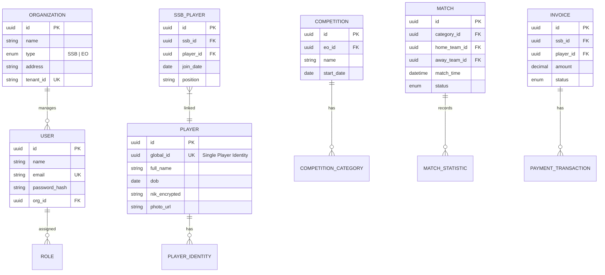

# Football Grassroots Ecosystem Platform - Architecture Documentation

## 1. System Overview
Platform terintegrasi yang menghubungkan SSB (Academy) dan EO (Competition) melalui **Single Player Identity**.

## 2. Clean Architecture Folder Structure
Struktur folder mengikuti prinsip Clean Architecture untuk skalabilitas dan maintainability.

```text
/src
  /domain          # Enterprise Business Rules (Entities, Value Objects)
    /entities
    /repository-interfaces
  /application     # Application Business Rules (Use Cases, DTOs)
    /use-cases
    /services
  /infrastructure  # Frameworks & Drivers (DB, API Clients, Caching)
    /database
    /external-apis (Midtrans, WhatsApp)
    /persistence
  /presentation    # Interface (UI, Controllers, ViewModels)
    /components
    /pages
    /hooks
    /contexts
  /types           # Shared Type Definitions
  /lib             # Shared Utilities
```

## 3. Entity Relationship Diagram (ERD) - 3NF
Desain database PostgreSQL yang mendukung multi-tenancy dan data isolation.



## 4. RBAC - 7 Level User Roles
1. **Super Admin**: Akses seluruh ekosistem dan tenant.
2. **EO Admin**: Manajemen kompetisi, keuangan EO, dan pendaftaran tim.
3. **EO Operator**: Input skor pertandingan dan statistik real-time di lapangan.
4. **SSB Admin**: Manajemen akademi, pendaftaran pemain, dan keuangan SSB.
5. **Coach**: Manajemen jadwal latihan, absensi, dan player development tracking.
6. **Parent**: Monitoring progress anak, jadwal, dan pembayaran iuran.
7. **Scout**: Akses data statistik pemain untuk pencarian bakat (view-only).

## 5. Technology Stack
- **Frontend**: React, Tailwind CSS, Shadcn UI, Recharts.
- **State Management**: React Query (Caching), Context API.
- **Backend**: Microservices (Node.js/Go), API Gateway.
- **Database**: PostgreSQL (Main), Redis (Caching).
- **Messaging**: RabbitMQ/Kafka (Sync data antar module).
- **DevOps**: Docker, Kubernetes, ELK Stack.
