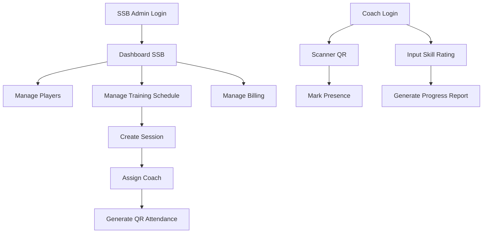
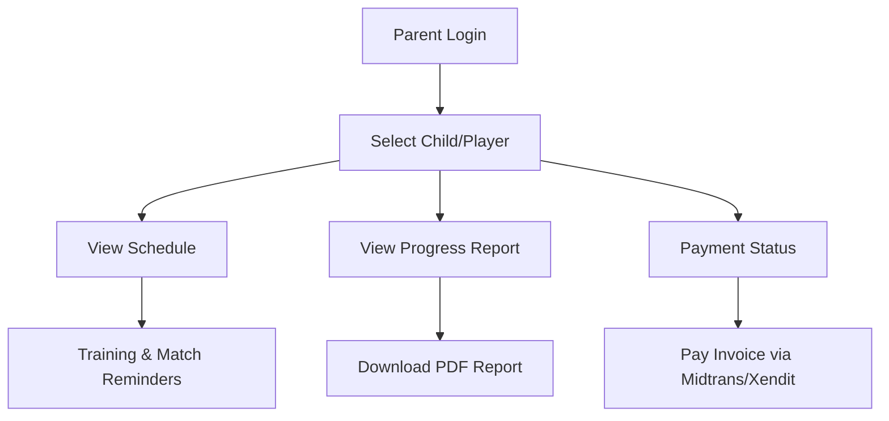
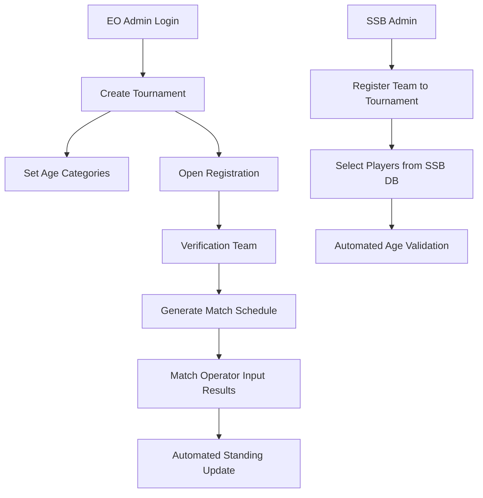
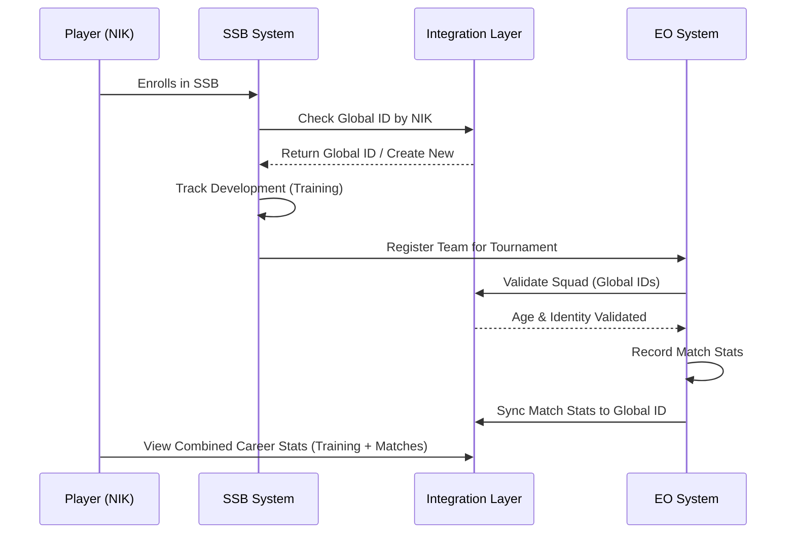

# User Flow Diagrams: Football Grassroots Ecosystem Platform

## 1. SSB Admin & Coach Flow

```mermaid
graph TD
    A[SSB Admin Login] --> B[Dashboard SSB]
    B --> C[Manage Players]
    B --> D[Manage Training Schedule]
    B --> E[Manage Billing]
    
    D --> F[Create Session]
    F --> G[Assign Coach]
    G --> H[Generate QR Attendance]
    
    I[Coach Login] --> J[Scanner QR]
    J --> K[Mark Presence]
    I --> L[Input Skill Rating]
    L --> M[Generate Progress Report]
```

## 2. Parent Portal Flow

```mermaid
graph TD
    A[Parent Login] --> B[Select Child/Player]
    B --> C[View Schedule]
    B --> D[View Progress Report]
    B --> E[Payment Status]
    
    C --> F[Training & Match Reminders]
    D --> G[Download PDF Report]
    E --> H[Pay Invoice via Midtrans/Xendit]
```

## 3. EO Admin & Tournament Flow

```mermaid
graph TD
    A[EO Admin Login] --> B[Create Tournament]
    B --> C[Set Age Categories]
    B --> D[Open Registration]
    
    E[SSB Admin] --> F[Register Team to Tournament]
    F --> G[Select Players from SSB DB]
    G --> H[Automated Age Validation]
    
    D --> I[Verification Team]
    I --> J[Generate Match Schedule]
    J --> K[Match Operator Input Results]
    K --> L[Automated Standing Update]
```

## 4. Single Player Identity Integration

```mermaid
sequenceDiagram
    participant P as Player (NIK)
    participant S as SSB System
    participant I as Integration Layer
    participant E as EO System
    
    P->>S: Enrolls in SSB
    S->>I: Check Global ID by NIK
    I-->>S: Return Global ID / Create New
    S->>S: Track Development (Training)
    
    S->>E: Register Team for Tournament
    E->>I: Validate Squad (Global IDs)
    I-->>E: Age & Identity Validated
    E->>E: Record Match Stats
    E->>I: Sync Match Stats to Global ID
    
    P->>I: View Combined Career Stats (Training + Matches)
```
