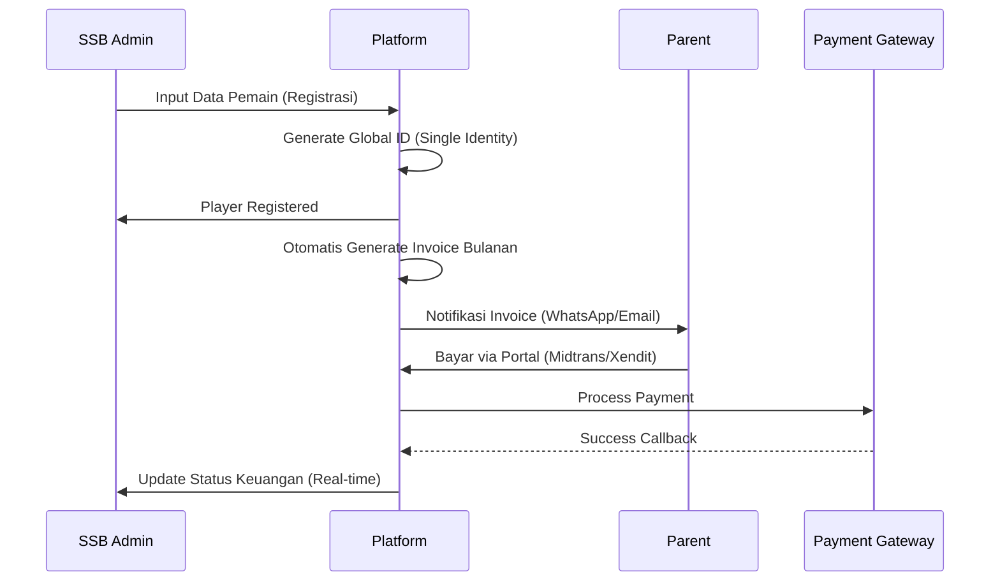
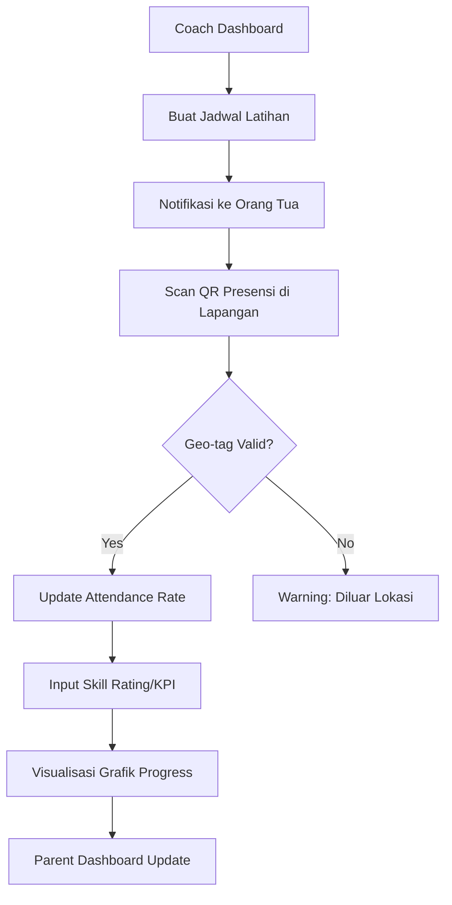
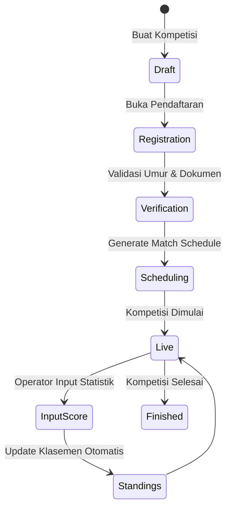

# Football Grassroots Ecosystem Platform - User Flow (BPMN 2.0 Simplified)

## 1. SSB Admin: Player Onboarding & Billing

## 2. Coach: Training & Development Tracking

## 3. EO Admin & Operator: Competition Workflow

## 4. Parent: Monitoring & Payment
- **Happy Path**: Lihat Jadwal -> Cek Progress Skill -> Bayar Iuran -> Terima Notifikasi Hasil Pertandingan.
- **Exception Handling**: Pembayaran Gagal -> Notifikasi Retry -> Hubungi Admin via WhatsApp Integrated.
