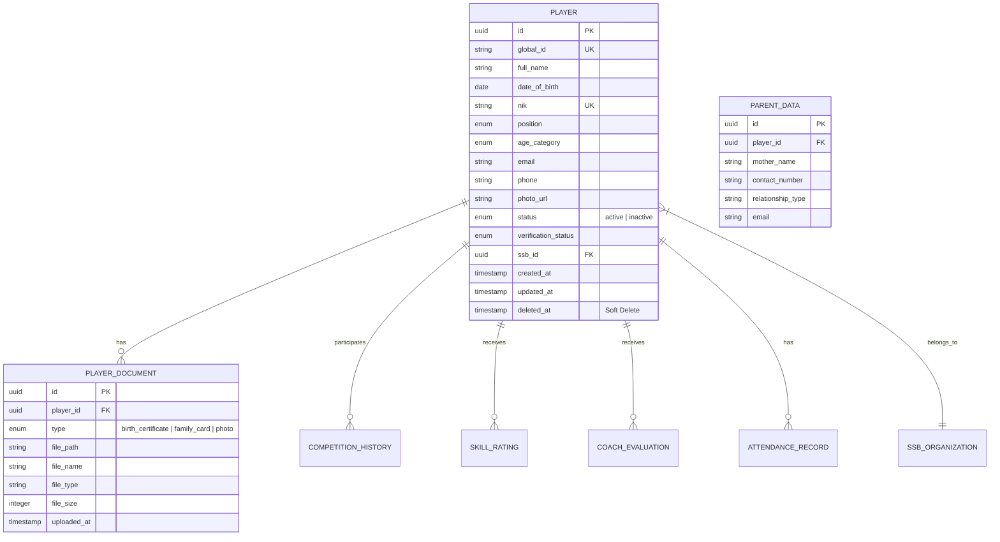

# Player Management ERD & Database Schema

## 1. Entity Relationship Diagram (Mermaid)



## 2. Database Schema (PostgreSQL)

```sql
-- Enums
CREATE TYPE player_position AS ENUM ('goalkeeper', 'defender', 'midfielder', 'forward');
CREATE TYPE player_status AS ENUM ('active', 'inactive');
CREATE TYPE age_category AS ENUM ('U9', 'U11', 'U13', 'U15', 'U17', 'U20');
CREATE TYPE doc_type AS ENUM ('birth_certificate', 'family_card', 'photo');

-- Player Table
CREATE TABLE players (
    id UUID PRIMARY KEY DEFAULT gen_random_uuid(),
    global_id VARCHAR(50) UNIQUE NOT NULL,
    full_name VARCHAR(100) NOT NULL,
    date_of_birth DATE NOT NULL,
    nik CHAR(16) UNIQUE NOT NULL,
    position player_position NOT NULL,
    age_category age_category NOT NULL,
    email VARCHAR(255),
    phone VARCHAR(20),
    photo_url TEXT,
    status player_status DEFAULT 'active',
    ssb_id UUID NOT NULL,
    created_at TIMESTAMP WITH TIME ZONE DEFAULT CURRENT_TIMESTAMP,
    updated_at TIMESTAMP WITH TIME ZONE DEFAULT CURRENT_TIMESTAMP,
    deleted_at TIMESTAMP WITH TIME ZONE,
    
    CONSTRAINT check_full_name_length CHECK (char_length(full_name) >= 3)
);

-- Indexing for Search & Filter
CREATE INDEX idx_players_full_name ON players(full_name);
CREATE INDEX idx_players_position ON players(position);
CREATE INDEX idx_players_age_category ON players(age_category);
CREATE INDEX idx_players_status ON players(status);
CREATE INDEX idx_players_ssb_id ON players(ssb_id);

-- Parent Table
CREATE TABLE parents (
    id UUID PRIMARY KEY DEFAULT gen_random_uuid(),
    player_id UUID REFERENCES players(id) ON DELETE CASCADE,
    mother_name VARCHAR(100) NOT NULL,
    contact_number VARCHAR(20) NOT NULL,
    relationship_type VARCHAR(50) DEFAULT 'Mother',
    email VARCHAR(255),
    created_at TIMESTAMP WITH TIME ZONE DEFAULT CURRENT_TIMESTAMP
);

-- Documents Table
CREATE TABLE player_documents (
    id UUID PRIMARY KEY DEFAULT gen_random_uuid(),
    player_id UUID REFERENCES players(id) ON DELETE CASCADE,
    type doc_type NOT NULL,
    file_path TEXT NOT NULL,
    file_name TEXT NOT NULL,
    file_type VARCHAR(50) NOT NULL,
    file_size INTEGER NOT NULL,
    uploaded_at TIMESTAMP WITH TIME ZONE DEFAULT CURRENT_TIMESTAMP
);

-- Audit Trail for Status Changes
CREATE TABLE player_status_logs (
    id UUID PRIMARY KEY DEFAULT gen_random_uuid(),
    player_id UUID REFERENCES players(id),
    old_status player_status,
    new_status player_status,
    changed_by UUID,
    changed_at TIMESTAMP WITH TIME ZONE DEFAULT CURRENT_TIMESTAMP,
    reason TEXT
);
```
